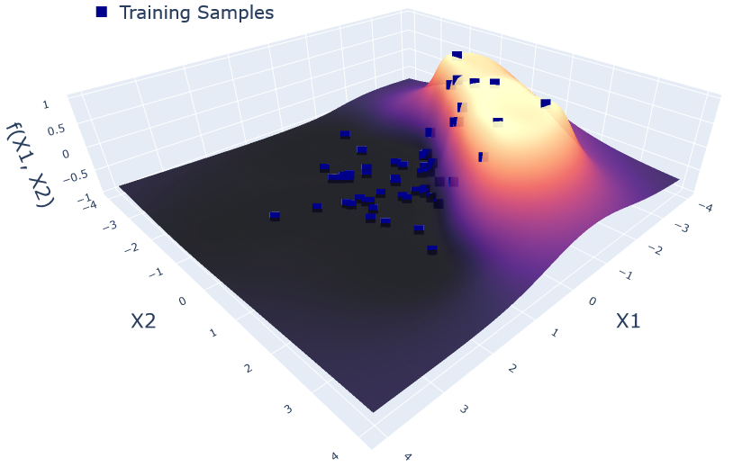
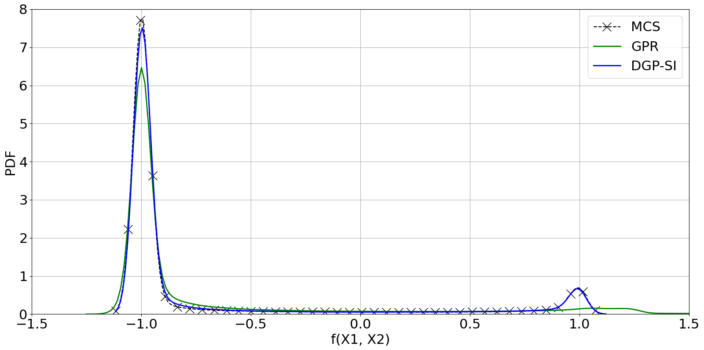

# DGP-StochasticImputation

  
  

A C++ implementation of [1] Deep Gaussian Process with Stochastic Imputation. This code was written for my Masters thesis : "Modeling Non-Stationarity with Deep Gaussian Processes: Applications in Aerospace Engineering" [2]. The original Python implementation can be found in (https://github.com/mingdeyu/DGP).

The library depends on several external (header-only) libraries, mainly: `Eigen`, `ThreadPool` and `optim` (https://github.com/kthohr/optim).
However, the main optimizer is an LBFFGSB which requires a Fortran compiler.

The current code is a rough draft.

TODO:

- Rewrite demo.cpp
- Remove (or integrate Particle Swarm/Adam/ConjugateGrad optimizer) optim dependency
- Add LBFGSB header-only
- Add CMakeLists.txt
- Implement Eigen Tensor operations for further vectorization of kernel expectations
- Implement automatic differentiation
- Interface with Python using pybind11

References:

[1] Ming, D., Williamson, D., and Guillas, S., “Deep Gaussian Process Emulation using Stochastic Imputation,” ArXiv, Vol.
abs/2107.01590, 2021.

[2] Izzaturrahman, M.F., Palar, P.S., Zuhal, L. and Shimoyama, K., 2022. Modeling Non-Stationarity with Deep Gaussian Processes: Applications in Aerospace Engineering. In AIAA SCITECH 2022 Forum (p. 1096).
